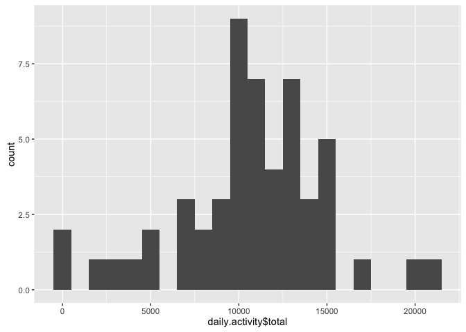
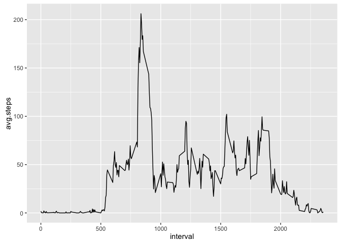
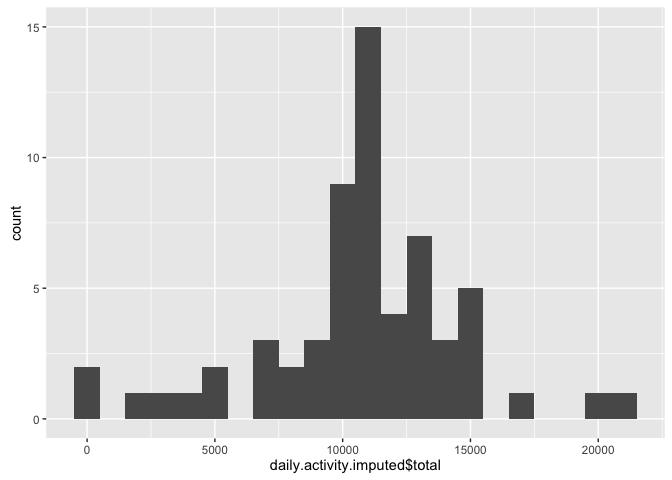
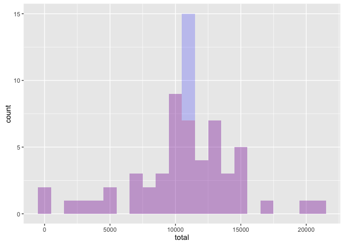
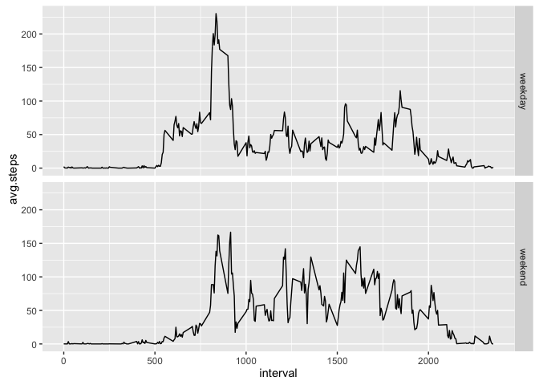

# Reproducible Research: Peer Assessment 1


## Loading and preprocessing the data

Read in the `activity.csv` file:


```r
library(lubridate)
```

```
## Warning: package 'lubridate' was built under R version 3.2.3
```

```r
activity = read.csv('activity.csv', na.strings = "NA")
activity$date <- ymd(activity$date)
head(activity)
```

```
##   steps       date interval
## 1    NA 2012-10-01        0
## 2    NA 2012-10-01        5
## 3    NA 2012-10-01       10
## 4    NA 2012-10-01       15
## 5    NA 2012-10-01       20
## 6    NA 2012-10-01       25
```


## What is mean total number of steps taken per day?


```r
library(dplyr)
```

```
## 
## Attaching package: 'dplyr'
```

```
## The following objects are masked from 'package:lubridate':
## 
##     intersect, setdiff, union
```

```
## The following objects are masked from 'package:stats':
## 
##     filter, lag
```

```
## The following objects are masked from 'package:base':
## 
##     intersect, setdiff, setequal, union
```

```r
daily.activity <- group_by(activity, date) %>% summarize(total = sum(steps))
```

1. Histogram of the total number of steps taken each day 
(choosing a `binwidth=1000` based on experience with my Fitbit Surge...)


```r
library(ggplot2)
qplot(daily.activity$total, binwidth=1000)
```

```
## Warning: Removed 8 rows containing non-finite values (stat_bin).
```



We see that hitting 10'000 steps a day (and above) was achieved quite often. Yay! I wish *my* Fitbit stats looked like that...


2. *mean* and *median* total number of steps taken each day

Let's add some more statistical punch to the observation above... 

- The mean total number of steps taken each day was 

```r
mean(daily.activity$total, na.rm=TRUE)
```

```
## [1] 10766.19
```
- and the median was 

```r
median(daily.activity$total, na.rm=TRUE)
```

```
## [1] 10765
```

## What is the average daily activity pattern?

1. Make a time series plot (i.e. type = "l") of the 5-minute interval (x-axis) and the average number of steps taken, averaged across all days (y-axis)

We need to re-group the data, this time per interval:


```r
interval.activity <- group_by(activity, interval) %>% summarize(avg.steps = mean(steps, na.rm = TRUE))
```

Then we can plot the time series:


```r
qplot(interval, avg.steps, data=interval.activity, geom='line')
```



2. Which 5-minute interval, on average across all the days in the dataset, contains the maximum number of steps?


```r
filter(interval.activity, avg.steps==max(avg.steps)) %>% select(interval)
```

```
## Source: local data frame [1 x 1]
## 
##   interval
##      (int)
## 1      835
```

Looks like at interval 835.


## Imputing missing values

Note that there are a number of days/intervals where there are missing values (coded as NA). The presence of missing days may introduce bias into some calculations or summaries of the data.

Right... I don't wear my fitbit all the time either - my wrist would start stinking! (true story...)

1. Calculate and report the total number of missing values in the dataset (i.e. the total number of rows with NAs)


```r
sum(is.na(activity$steps))
```

```
## [1] 2304
```

There are a total of 2304 missing values in the dataset.

2. Devise a strategy for filling in all of the missing values in the dataset. The strategy does not need to be sophisticated. For example, you could use the mean/median for that day, or the mean for that 5-minute interval, etc.

I decide to use the mean for the 5-minute interval. Now I just need to figure out how to add this to the dataset...
Let's create an `activity.imputed` version...


```r
activity.imputed <- merge(activity, interval.activity)
activity.imputed$steps <- ifelse(is.na(activity.imputed$steps), 
                                         activity.imputed$avg.steps, activity.imputed$steps)
```

3. Create a new dataset that is equal to the original dataset but with the missing data filled in.

see `activity.imputed` above. let's just drop off the `avg.steps` column to make it equal to the original dataset:


```r
activity.imputed <- select(activity.imputed, steps, date, interval)
```

4. Make a histogram of the total number of steps taken each day and Calculate and report the mean and median total number of steps taken per day. Do these values differ from the estimates from the first part of the assignment? What is the impact of imputing missing data on the estimates of the total daily number of steps?

Let us reuse some code from above, but using `activity.imputed` as input instead:


```r
daily.activity.imputed <- group_by(activity.imputed, date) %>% summarize(total = sum(steps))
qplot(daily.activity.imputed$total, binwidth=1000)
```



- The mean total number of steps taken each day was 

```r
mean(daily.activity.imputed$total)
```

```
## [1] 10766.19
```
(this is a difference of 0 - the mean does not change!)

- and the median was 

```r
median(daily.activity.imputed$total)
```

```
## [1] 10766.19
```
(this is a difference of 1.1886792 - the median shifts to the right)

If we compare the histograms by placing them over each other:


```r
ggplot(data=daily.activity, aes(x = total)) + geom_histogram(data=daily.activity, fill='red', alpha=0.2, binwidth=1000) + geom_histogram(data=daily.activity.imputed, fill='blue', alpha=0.2, binwidth=1000)
```

```
## Warning: Removed 8 rows containing non-finite values (stat_bin).
```



we see how these differences play out... The bin 11'000-12'000 gains a lot of new values.

## Are there differences in activity patterns between weekdays and weekends?

1. Create a new factor variable in the dataset with two levels -- "weekday" and "weekend" indicating whether a given date is a weekday or weekend day.


```r
activity.imputed$day <- factor(weekdays(activity.imputed$date) %in% c('Saturday', 'Sunday'))
levels(activity.imputed$day)[levels(activity.imputed$day) == TRUE] <- 'weekend'
levels(activity.imputed$day)[levels(activity.imputed$day) == FALSE] <- 'weekday'
```

2. Make a panel plot containing a time series plot (i.e. type = "l") of the 5-minute interval (x-axis) and the average number of steps taken, averaged across all weekday days or weekend days (y-axis). The plot should look something like the following, which was created using simulated data:


```r
interval.activity.imputed <- group_by(activity.imputed, day, interval) %>% summarize(avg.steps = mean(steps))
p <- ggplot(interval.activity.imputed, aes(x=interval, y=avg.steps)) + geom_line() + facet_grid(day ~ .)
print(p)
```



Yes, there are differences in the activity patterns! It looks like subject does a morning walk on weekdays, but on weekends subject gets up off the couch and does stuff the whole day long!
